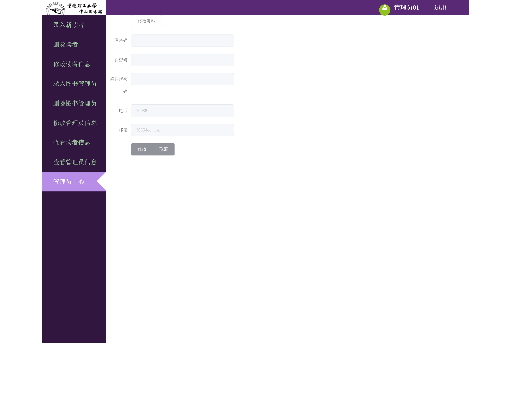

# 图书管理系统（bookmangement）
重庆理工大学专业实习 微信+Web：图书管理系统

# 功能介绍

## 服务器

- 图书查询功能模块：不需要登录，可以查询图书的相关信息
- 读者功能模块：登录、图书查询、个人信息查看和维护
- 图书管理员功能：登录、读者信息查询、借书、还书、图书信息管理（增删改查，包括批量导入），打印图书二维码（可选）
- 系统管理员模块：登录、用户管理（增删改查，包括批量导入）、角色管理（增删改查）、权限管理（增删改查），打印用户借阅证（可选）

## 移动端

- 图书查询功能模块：不需要登录，可以查询图书的相关信息
- 读者移动端：登录、图书查询、个人信息查看和维护
- 图书管理员移动端：登录、读者信息查询、借书、还书、图书信息管理（增删改查）
- 系统管理员移动端：登录、用户管理（增删改查，包括批量导入）、角色管理（增删改查）、权限管理（增删改查）


# 界面展示


## 微信端


<center>登陆界面</center>


<center>图书搜索</center>


## 网页端


<center>登陆界面</center>


<center>搜索结果</center>



<center>系统管理员</center>


<center>系统管理员搜索</center>

# 配置说明

## 网页前端

Vue中部分模块并未下载完全，需要在联网时运行才行

## 微信前端

微信前端使用小程序开发工具开发

## 数据库

数据库使用的是`mysql`，数据库中的模拟数据存储在`/src/main/resources/bookmanagement.sql`中，需要修改`/src/main/resources/application.yml`中的数据库连接信息

```sql
/*
Navicat MySQL Data Transfer

Source Server         : mysql80
Source Server Version : 50724
Source Host           : localhost:3306
Source Database       : bookmanagement

Target Server Type    : MYSQL
Target Server Version : 50724
File Encoding         : 65001

Date: 2019-06-01 20:10:32
*/

SET FOREIGN_KEY_CHECKS=0;

-- ----------------------------
-- Table structure for bookadmin
-- ----------------------------
DROP TABLE IF EXISTS `bookadmin`;
CREATE TABLE `bookadmin` (
  `AdName` varchar(255) DEFAULT NULL,
  `AdId` varchar(36) NOT NULL,
  `AdPassword` varchar(255) NOT NULL,
  `AdPhone` varchar(255) NOT NULL,
  `AdEmail` varchar(255) DEFAULT NULL,
  PRIMARY KEY (`AdId`)
) ENGINE=InnoDB DEFAULT CHARSET=utf8;
```

# 特殊说明

`HELP.md`中为服务端与客户端的通信协议

项目暂时还未部署演示地址，后面可能会考虑加入

微信前端的代码使用过上一届的学长获得。